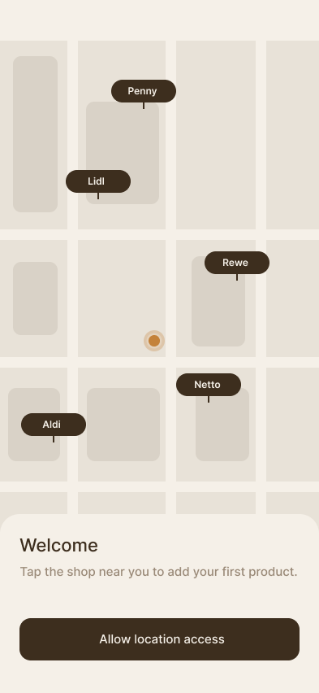
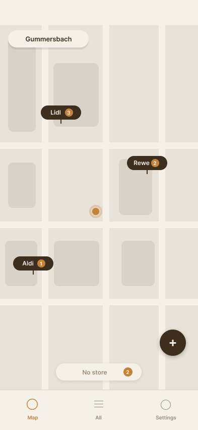
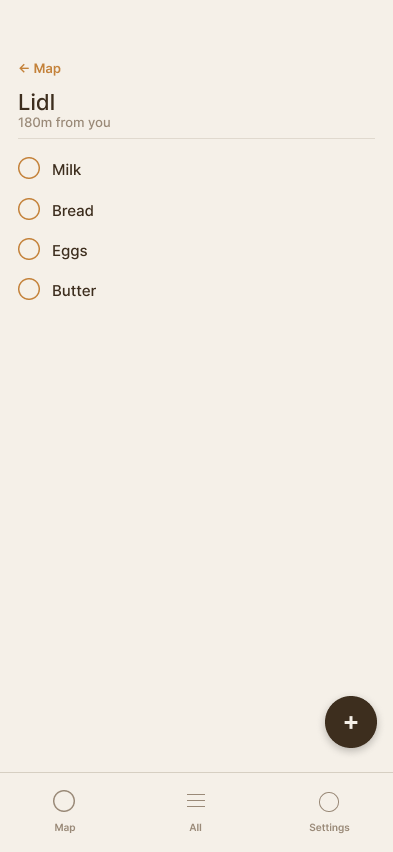
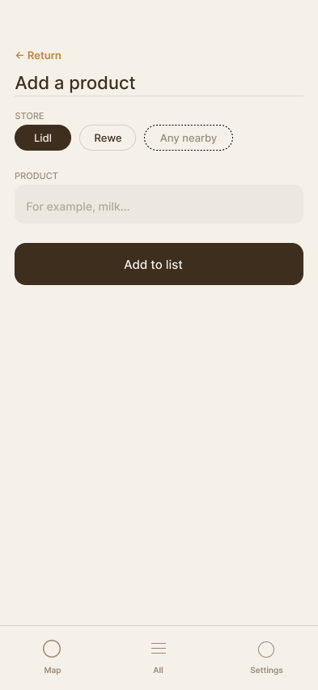
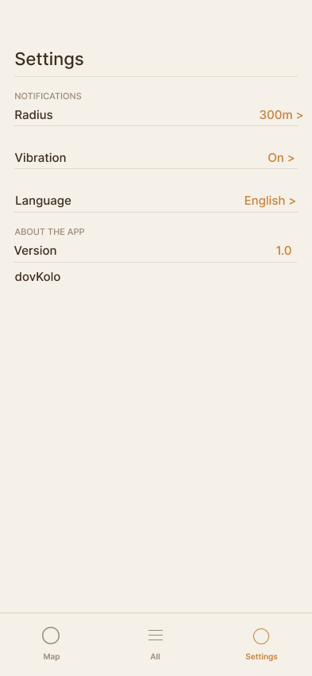

# dovKolo
 
> *Stores around you. Walk & don't forget.*
 
A location-based shopping reminder app for Android. dovKolo notifies you when you're physically near a store where you have items on your list — so you never walk past a shop and forget what you needed.
 
The name comes from the Ukrainian word **довколо** — meaning *around / nearby*.
 
---
 
## How it works
 
1. Add items to your shopping list and assign them to a store
2. dovKolo watches your location in the background
3. When you're within your set radius of a store — it vibrates and notifies you
4. Open the app, check off what you need
---
 
## Screenshots
 
| Onboarding | Map view | Store list | Add item | Settings |
|---|---|---|---|---|
|  |  |  |  |  |
 
---
 
## Features
 
- 📍 Map with store pins and item counters
- 🛒 Shopping lists organized by store
- 📳 Vibration + push notification on proximity
- ⚙️ Adjustable notification radius (default 300m)
- 🌙 Dark mode support
- 🌐 Multilingual interface
---
 
## Tech stack
 
| Layer | Technology |
|---|---|
| Framework | Flutter |
| Language | Dart |
| Maps | OpenStreetMap |
| Location | Geolocator |
| Local storage | Hive |
 
---
 
## Status
 
🚧 In active development — core features working, currently refining UX and adding notifications.
 
---
 
## About
 
Built by [Daria Rozhkova](https://github.com/daria-rozhkova) Media Informatics student at TH Köln.  
